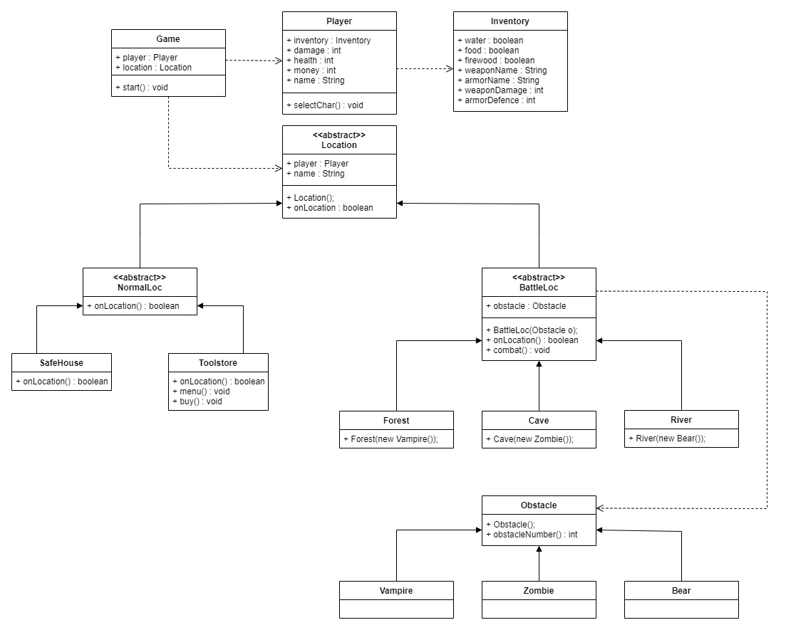

# Adventure Game

Text based adventure game

##### CHARACTERS

| Character | Id  | Damage | Health | Money |
| --------- | --- | ------ | ------ | ----- |
| Samurai   | 1   | 5      | 21     | 15    |
| Archer    | 2   | 7      | 18     | 20    |
| Knight    | 3   | 8      | 24     | 5     |

##### MONSTERS

| Monster | Id  | Damage | Health | Money |
| ------- | --- | ------ | ------ | ----- |
| Zombie  | 1   | 3      | 10     | 4     |
| Vampire | 2   | 4      | 14     | 7     |
| Bear    | 3   | 7      | 20     | 12    |

##### WEAPONS

| Weapon | Id  | Damage | Money |
| ------ | --- | ------ | ----- |
| Pistol | 1   | 2      | 25    |
| Sword  | 2   | 3      | 35    |
| Rifle  | 3   | 7      | 45    |

##### ARMOURS

| Armour | Id  | Shield | Money |
| ------ | --- | ------ | ----- |
| Light  | 1   | 1      | 15    |
| Medium | 2   | 3      | 25    |
| Heavy  | 3   | 5      | 40    |

### PLACES

- Safe House
  - Attribute: Restores health
- Cave
  - Monster: Zombie (1-3)
  - Attribute: War + Loot
  - Item: Food
- Forest
  - Monster: Vampire (1-3)
  - Attribute: War + Loot
  - Item: Firewood
- River
  - Beast: Bear (1-3)
  - Attribute: War + Loot
  - Item: Water
- Shopping centre
  - Feature: Supporting items are purchased
  - Weapons: Pistol, Sword, Rifle
  - Armours: Light, Medium, Heavy
